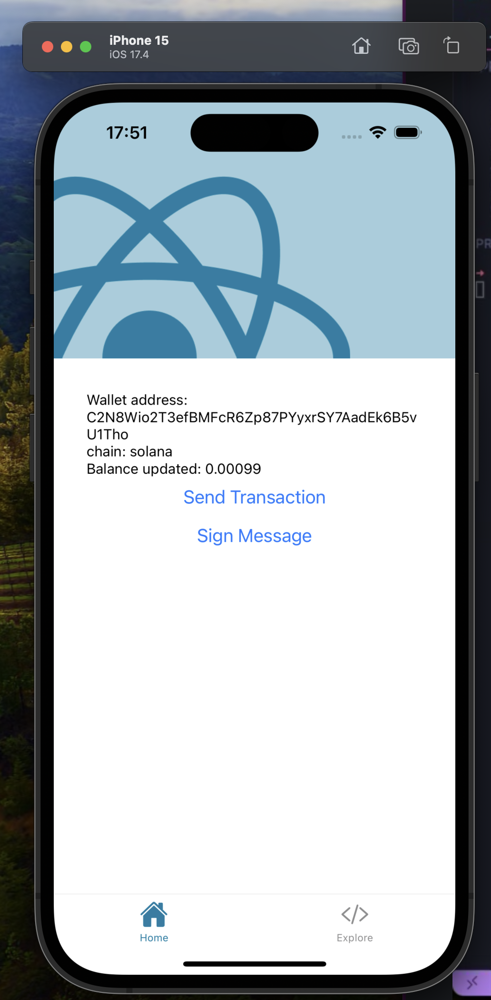

# Test app for react-native silent signing and solana with dynamic sdk

## Get started

1. Install dependencies

   ```bash
   npm install
   ```

2. environment variables
   add your env id, destination address in the [client.ts](https://github.com/andreaswierm/react-native-silent-signin-and-solana/blob/main/client.ts) file

3. Start the app

   ```bash
    npx expo run:ios
   ```

## How to test

- Login with dynamic
- Fund your wallet with some SOL
- Click on "Send Transaction" button
- Confirm transaction
- The transaction signature should be logged in the console


